# 对偶支持向量机

咦？怎么还有关于支持向量机的内容，我们不是在上一讲已经将支持向量机解决了么？怎么又引入了对偶这个概念？

## 1.动机

我们在上一讲已经讲过，可以使用二次规划来解决支持向量机的问题。如果现在想要解决非线性的支持向量机的问题，也很简单，如下图所示：

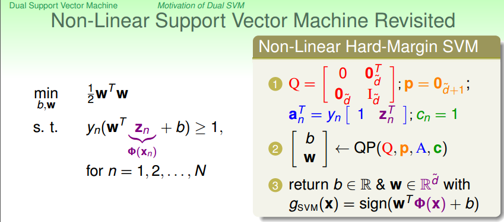

我们只需要将原来的有关于X的内容通过转换变为Z，剩下的事情就一样了。在Z空间里面，将Q,P,A,C等填充好，然后丢到一个二次规划的软件里去求得一个Z空间的最佳的w和b。所以我们需要解决的是Z空间的二次规划问题，我们想象一下，但是当我们Z空间的维度(d)很高时(甚至无限维)，我们的二次规划解起来具有一定的挑战性。

所以说，如果我们想要做高维度特征的SVM，如何移除掉对于特征维度的依赖？使高维甚至无限维的特征的SVM称为可能？这就是我们考虑对偶支持向量机的动机。

## 2. 学习的对偶算法

因为我们的SVM的原始问题是一个受限制的最优化问题，回想之前做regularization时候，我们的regularization也是一个受限制的最优化问题，我们应用拉格朗日乘数法，来得到一个不受限制的正则项表达式。同理，我们也可以在此应用拉格朗日乘数法，将有条件的SVM问题变成没有条件的SVM问题，紧接着利用拉格朗日对偶性，得到对偶问题，对偶中可以有效地移除对特征维度的依赖性，所以我们可以用过求解对偶问题来得到原始问题的最优解。如果对拉格朗日乘数法不理解，可以点击如下链接：[拉格朗日乘数法](http://open.163.com/movie/2010/8/P/C/M6TUC9K75_M6TUI4FPC.html)，这个视频讲得很不错的。

### 2.1 拉格朗日函数

首先构建拉格朗日函数：

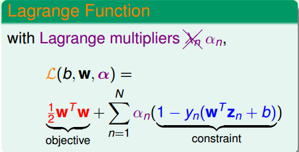

我们的拉格朗日函数由两部分组成
* 第一部分：原始的目标函数
* 第二部分：对原始问题的每一个限制条件均乘上一个朗格朗日乘子，然后在求和

现在拉格朗日函数写出来了，那如何来求解拉格朗日函数来求得我们的最优解呢？（也就是说函数写出来了，你是通过最大值还是最小值来求最佳解？）

#### 2.1.1 拉格朗日原始问题
通过拉格朗日函数，我们可以求解的SVM问题写为如下形式。解释一下下面这个形式所表达的意义

* 首先选定一个(w,b)
* 然后找到a使L()的值最大
* 然后通过w,b,a计算L()的值
* 选定另一个(w,b)做相同的步骤，得出相应的L()值
* 选定完所有的(w,b)之后，找出L()值最小的wb,即是最优解

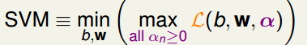

为什么可以写成这个形式呢？这个问题的最优解和原始问题一致么？下面我们就来证明这件事情。

算法的第一步是选出一个(w,b)来，选出的这个(w, b)有两种可能：

* 如果选出来的(w, b)是坏的，也就是说我们的(w, b)会违反某些限制条件，也就是说某些1-Yn(W.Zn + b)的项本来是要小于等于0的，现在大于0了，那如果对an(1-Yn(W.Zn + b))求最大值，那最终L()就是无穷大了。
* 如果选出来的(w, b)是好的，也就是说(w, b)满足所有的限制条件，也就是所有的1-Yn(W.Zn + b)要小于等于0，那an(1-Yn(W.Zn + b))什么时候能够得到最大值呢？那就是an等于0才是最大值。当an等于0时，我们的问题就剩下min 1/2 w * w了（原始的最优化问题）。

根据之前所说表达式的意义，最后一步是选出L()值最小的(w, b)，由于那些坏的(w, b)的L()值为无穷大，所以那些坏的(w, b)被自动排除了。剩下的就是从好的(w, b)（他们的an均为0）中，选出使L()=1/2 w * w的值最小的(w, b)。所以这不就是我们原始问题做的事情么？

所以朗格朗日函数的最优解也就是我们原始问题的最优解。

#### 2.1.2 拉格朗日对偶问题

接下来我们继续对拉格朗日函数做变换，来实现我们‘动机’章节所说的消除对特征维度的依赖。

如下图所示，可以很容易得出下图的结论

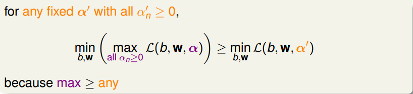

图中大于号右侧的表达式表示仅仅根据b.w来求表达式的最小值，a为一个任意的固定值。大于号左侧的表达式表示先求表达式关于a的最大值，然后再求关于b.w的最小值，所以显而易见不等式成立。也就是说，对于右侧的任何一个固定的a值，都有以上结果。

进一步地，既然任意的a都有以上结果，那现在在右侧加一个max的动作的话，那不等式也依然成立咯。

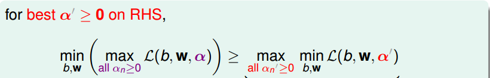

上图中不等式右侧的式子又叫做拉格朗日原始问题（注意这里指的是拉格朗日原始问题，并不是SVM的原始问题，不要混淆）的对偶问题，可以看出对偶问题将原始问题的max/min对调了。

但是从图中我们可以看出，原始问题和对偶问题是大于等于的关系，那么拉格朗日对偶问题的最优解也是拉格朗日原始问题的最优解么？

在最佳化文献中，我们管 >= 叫做weak duality，弱的对偶关系。但是我们不想要这种关系，我们能不能够直接将上式从不等式变为等式呢？变为等式后，对偶问题的最佳解就是原始问题的最佳解了。

那么有没有什么理论来保证这个等式成立呢？做在最佳化理论中，如果我们的SVM原始问题（QP问题）满足以下条件：

* 目标函数是凸的
* 是有解的（也就是能找到一条线将资料正确分开）
* 线性的限制条件（QP本来就有）

那我们的强对偶关系就成立。所以就可以通过解对偶问题来得到原始问题的最优解。我们把对偶问题的推导过程叫做拉格朗日对偶性

### 2.2 求解拉格朗日对偶问题

现在的拉格朗日对偶问题的形式如下：

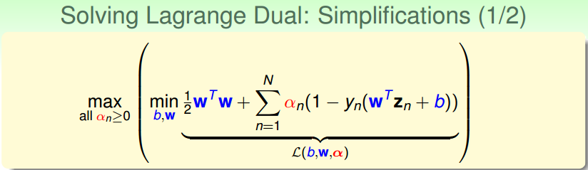

我们可以看到，在大括号内部，是一个关于wb的无条件的最优化问题。请记住我们的初衷，我们是想移除掉特征维度的依赖，所以我们接下来的事情就是通过某些关系来将w,b从我们的问题中移除。

#### 2.2.1 KKT condition

对于我们的对偶问题，大括号内部是关于w和b的无条件最优化问题。无条件最优化问题我们会解啊，可以分别对w和b求偏微分等于0，就可以分别得到w和b的表达式。好，现在就来做

首先来对b做偏微分：

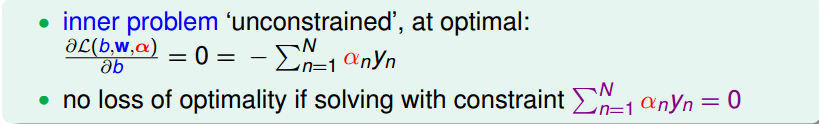

上式的结果不必多说吧，我们再把上式的结果带回函数中，会发现b被成功地消除掉了：

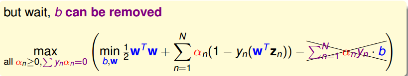

然后我们在对w做偏微分：

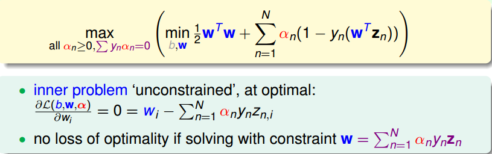

可以将w用另一个表达式表示出来，所以可以将该表达式带回原函数中，将w用anynzn来表示：

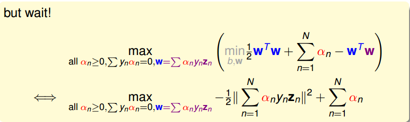

经过上面的步骤，w和b已经基本消失了，对偶问题中的min也不用做了，剩下的事情就是做关于a的最优化（有条件限制的最优化）。

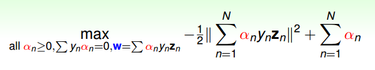

上图中表示的就是我们导出来的简化版的拉格朗日对偶问题。

从我们的推导过程可知，我们的最佳的a,w,b会满足某些关系，我们把这些关系叫做KKT condition：

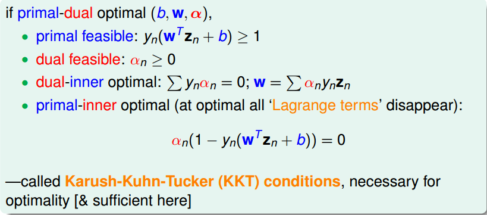

下面我们来一一解释KKT条件：

* 第一条是我们原始的SVM问题要满足的条件
* 第二条使我们拉格朗日原始/对偶问题的条件
* 第三条是我们对拉格朗日对偶问题的w,b参数做偏微分所得出的结论
* 第四条，我们在2.1.1节中，将SVM的原始问题（受限制）转换为拉格朗日原始问题（不受限）的过程中，证明该转换的有效性时，得出的一个结论。

这些条件有什么用呢？待会儿可以看到，当我们求出a后，可以用这些条件来求w和b。

#### 2.2.2 求解对偶问题

上一小结中我们得到了简化版的拉格朗日对偶问题，现在我们来做一点儿小小的变动，使其变成我们习惯的形式。

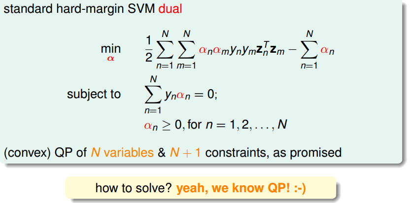

w的表达式我们没有将其作为条件列出来，因为现在求解的是a的问题，和w的限制条件没有关系，所以没将其列出来。

我们的新的问题有N个变量和N+1个条件，而且新问题还是一个凸的二次规划问题（目标函数为二次，限制条件为一次），所以说我们大费周章地将一个QP问题转换为另一个QP问题，这是因为点啥呢？哈哈，就是为了消除掉对特征维度的依赖啊，还有一个目的是为了引出很好用的kernel方法（请看下一篇文章）。

好，既然是新的QP问题，那解法当然和就的QP问题差不多啦，将所有的系数算出来，然后丢给二次规划软件就搞定啦。所以解法就不啰嗦了，看下图：

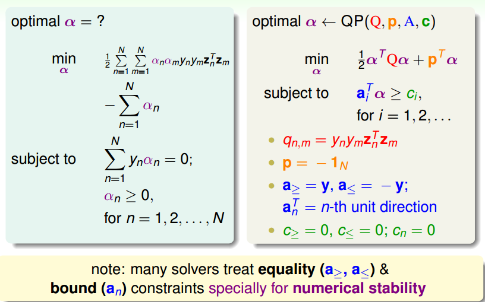

这里有一点值得注意，我们的条件式里面有一个是等于符号的条件(虽然MATLAB里面有处理等于条件的，但是MATLAB要求等于的条件的系数是矩阵，而我们只有y向量，所以不适用)，而我们的QPsolver软件一般要求的是不等式条件，所以我们就把等式条件∑ynan=0可以转变为两个条件不等式条件：

* ∑ynan >= 0
* ∑ynan <= 0

所以写成向量的形式就是：

* y.a  >= 0向量
* -y.a >= -0向量

然后把上述两个不等式和问题中本来有的不等式结合，就得出了不等式的系数矩阵A

* [
* [y..]
* [-y..]
* [ I..]
* .
* .
* ]

这是一个（N+2）x（N）大小的矩阵，其中第一行第二行分别为y和-y向量，剩余的就是一个NxN的单位矩阵。对应地，C向量是一个N+2 x 1的向量

#### 2.2.3 警告

在我们解决QP问题的过程中，会有一个二次系数矩阵Q，这个矩阵的大小是N x N的，从上一小节我们知道，Qmn = ym.yn.Zm.Zn，
当Zm与Zn垂直时，Qmn为0，但是Z向量垂直的情况毕竟是少数，也就是说我们的Q矩阵的元素大多数都不是0，我们管Q叫做密集的。

现在我们来看看，当N = 30000时（有30000个样本），就算Q是对称矩阵，只存一半，也需要花 > 3G 的内存来存储这些系数，所以这个Q矩阵很大。所看看起来没有原始的SVM的二次规划问题那么好解，原始SVM的QP问题的Q矩阵比较特殊，里面包含一个单位矩阵，只有对角线才有值，所以会占用比较少的内存。

所以我们通常在解决SVM问题的时候，不会使用一个通用的QP软件，而是会使用特殊的专为SVM设计的二次规划软件。也就是这种软件不会要求将Q矩阵先算出来，而是用到的时候再去算。

#### 2.2.4 求解b,w

假设我们通过二次规划软件将a解出来了，那么现在怎么得出b，w呢？

我们之前说过，KKT condition可以帮我们求解w和b。

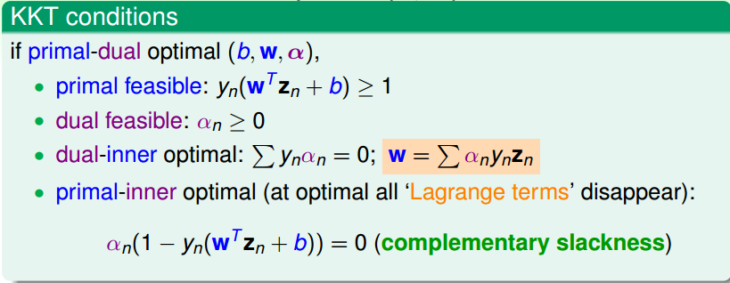

* 求解w : 求解w就很简单了，直接使用KKT条件的第三项
* 求解b : 求解b也不难，利用KKT条件的最后一项。我们知道，当an不等于0时，1-yn(wzn + b)肯定等于0。现在我们知道了所有的a，所以就找一个an不等于0的点，将其代入，求得b即可。

#### 2.2.5 a的稀疏性

根据KKT条件，我们可以轻易得出，a的解具有稀疏性(向量内的大多元素为0)。当yn(wzn+b)不等于1时，也就是该点位于我们的边界外时，这是我们的这些数据点的大多数的分布，根据KKT条件中的complementary slackness条件，我们得知，an为0，也就是大多数数据点的an为0，这也就说明了an的稀疏性。

## 3. 对偶算法的总结

从解w和b的过程中，我们知道。当an > 0时，1-yn(wzn + b)肯定等于0（KKT条件最后一项），也就是说yn(wzn + b) = 1，也就是说该(zn,yn)点的函数间隔等于1，所以说，该点处于边界上。也就是说所有an>0的点均位于边界上，对我们的边界起到一个支撑作用。我们这些位于边界上的点叫做支撑向量。其他非支撑向量的点，也就是an = 0的点对我们的边界的构建没有贡献，从w和b的表达式可以看出，an等于0的点不会贡献任何力量。

（注意：an > 0的点一定位于边界上，但是位于边界上的点并不一定是an > 0的。所以我们仅仅把an > 0的点叫做支撑向量）

所以，我们计算w和b的时候仅仅需要支撑向量的点就行了

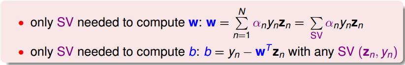

### 3.1 两种形式的hard-margin SVM

到现在我们已经学习两种形式的hard-margin SVM（hard-margin表示保证资料不违反边界），分别是原始的SVM问题和对偶的SVM问题：

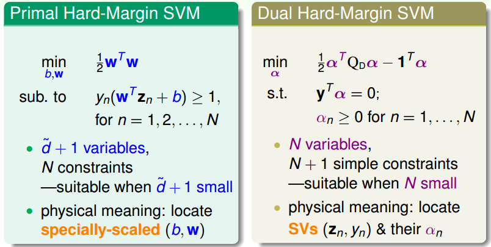

我们从原始问题的d空间切换到了新问题的N空间，原始问题比较适合解决d较小的情况，对偶问题适合解决N较小的情况

两个问题解决完成之后，都可以得到一个最佳的w,b，通过这个w,b就能得到我们的hypothesis：

